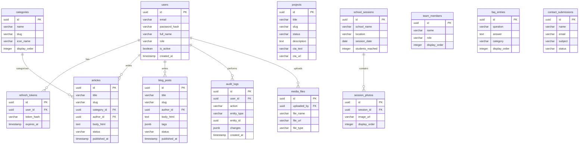

# Database Entity-Relationship Diagram
## **THE NAGRIK** — Civic Literacy Initiative

This diagram visualizes the relationships between the core entities in the PostgreSQL database as defined by the backend schema.

## Key Architectural Notes:
1. **Soft Deletes:** `articles`, `blog_posts`, `projects`, and `school_sessions` contain a `deleted_at` column.
2. **Auditability:** Every mutation made by a `user` triggers a record in `audit_logs`.
3. **Roles:** `users.role` is an enum (`super_admin`, `admin`, `editor`).
4. **Searchability:** Content tables contain a `search_vector` (`tsvector`) column for PostgreSQL full-text search.
