# Product Requirements Document (PRD)
## **THE NAGRIK** — Student-Led Civic Literacy & Public Awareness Initiative
### Website Product Specification v1.0

| Field | Value |
|---|---|
| **Document Version** | 1.0 |
| **Date** | June 6, 2026 |
| **Product Owner** | The Nagrik Foundation |
| **Document Type** | Product Requirements Document |
| **Classification** | Internal — Development Team |
| **Status** | Draft — Pending Stakeholder Approval |

---

# 1. Executive Summary

## 1.1 Product Vision

Build a world-class digital platform that transforms The Nagrik from a student-led initiative into India's most trusted civic literacy brand — a destination where young Indians learn, engage, and participate in democracy beyond textbooks.

## 1.2 Mission

> *"To build a generation of informed citizens who understand their rights, value their responsibilities, and participate meaningfully in India's democracy."*

## 1.3 Purpose

The website serves as the **primary digital presence** for The Nagrik — a student-led civic literacy and public awareness initiative. It must:

1. **Educate** — Deliver structured civic literacy content across 9+ categories (Constitution, Fundamental Rights, Judiciary, Elections, etc.)
2. **Engage** — Attract students, educators, schools, and partners through compelling storytelling and interactive content
3. **Activate** — Convert passive visitors into volunteers, school partners, survey participants, and advocates
4. **Establish Credibility** — Present a professional, trustworthy, and non-partisan brand that institutions can partner with
5. **Scale Operations** — Provide an admin-managed CMS that allows the team to publish content, manage projects, and track school outreach without developer intervention

## 1.4 Problem Statement

India is the world's largest democracy, yet civic knowledge among young Indians remains confined to textbooks and examinations. Concepts such as constitutional rights, public institutions, governance, policymaking, and citizenship are studied but rarely understood in a practical and meaningful way. There is no prominent, student-led, non-partisan digital platform that makes civic education accessible, engaging, and actionable for young Indians.

## 1.5 Opportunity

- **1.4 billion population** with a median age of ~28 — one of the youngest democracies globally
- **500M+ internet users** under 30 in India, creating a massive digital-first audience
- Civic education is part of the national curriculum but lacks practical, real-world application platforms
- No dominant student-led civic literacy platform exists in the Indian digital ecosystem
- Government and institutional interest in civic awareness programs is growing (National Education Policy 2020 emphasis on civic values)

## 1.6 Expected Impact

| Metric | 6-Month Target | 12-Month Target |
|---|---|---|
| Monthly website visitors | 5,000 | 25,000 |
| Learn page article reads | 2,000/mo | 15,000/mo |
| School partnerships initiated | 10 | 100 (100 Schools Initiative) |
| Civic Literacy Survey responses | 1,000 | 10,000 |
| Volunteer sign-ups | 50 | 300 |
| Newsletter subscribers | 500 | 5,000 |

---

# 2. Organization Overview

## 2.1 About The Nagrik

**The Nagrik** is a student-led civic literacy and public awareness initiative dedicated to making law, governance, public policy, and citizenship understandable and accessible to young Indians. The name "Nagrik" (Hindi: नागरिक) translates to "Citizen" — reflecting the core belief that citizenship is a learned practice, not merely an inherited status.

**Tagline:** *"Democracy is inherited. Citizenship is learned."*

**Sub-tagline:** *"Student-Led Civic Literacy & Public Awareness Initiative — Building Informed Citizens"*

## 2.2 Core Values

| Value | Description |
|---|---|
| **Accessibility** | Knowledge about governance, law, and citizenship should be understandable to everyone, regardless of background |
| **Non-Partisanship** | Nagrik does not endorse political parties or political candidates. Focus remains on civic education, institutional understanding, and informed participation |
| **Critical Thinking** | Students are encouraged to question, analyze, and engage with public issues thoughtfully and responsibly |
| **Service** | Citizenship is not only about rights; it is also about contributing positively to society and one's community |

## 2.3 Objectives

1. Bridge the gap between academic civics and real-world civic engagement
2. Break down complex worlds of law, governance, public policy, and democratic institutions into clear, engaging content
3. Inspire student peers to take active roles in shaping their communities
4. Scale civic literacy through the 100 Schools Initiative (launching July 2026)
5. Produce original research — Civic Literacy Survey 2026 and State of Civic Literacy Report

## 2.4 Public Image Goals

- **Professional** — Must look like a serious institution, not a student hobby project
- **Trustworthy** — Non-partisan positioning must be visually and tonally reinforced
- **Modern** — Design language must appeal to Gen-Z and millennial audiences
- **Approachable** — Content must feel welcoming, not academic or bureaucratic
- **Aspirational** — Visitors should feel inspired to act, not lectured

---

# 3. Product Overview

## 3.1 Website Purpose

A content-rich, CMS-managed informational website that serves as the digital headquarters for The Nagrik initiative. It is NOT a SaaS product or web application — it is a **content delivery and engagement platform** with light interactivity (forms, surveys, contact).

## 3.2 Website Type

| Attribute | Value |
|---|---|
| Type | Informational / Content / NGO |
| Architecture | Static-first with dynamic CMS backend |
| Interactivity | Low-Medium (forms, search, filtering) |
| User Accounts | Admin/Editor only (no public user accounts in MVP) |
| E-Commerce | None (MVP); Donation gateway (future) |
| Real-Time | None |

## 3.3 Key Capabilities

1. **Content Publishing** — Blog posts, articles organized by civic literacy categories
2. **Project Showcase** — Dynamic project cards with status tracking (Active, Coming Soon, Completed)
3. **School Outreach Tracking** — Session write-ups with photos, partner school listings
4. **Survey & Form Integration** — Embedded Tally/Google Forms for surveys and interest forms
5. **Contact & Volunteer Pipeline** — Contact forms, volunteer interest capture
6. **SEO-Optimized Content Delivery** — Every page optimized for organic search discovery
7. **Admin CMS** — Full content management without code deployment

## 3.4 Success Definition

The website is successful when:
- A first-time visitor immediately understands what The Nagrik does (< 5 seconds)
- A school administrator finds enough credibility to fill a partnership interest form
- A student can browse and read civic literacy content without friction
- The team can publish a new blog post or project update in under 5 minutes
- The site ranks on the first page of Google for "civic literacy India" within 6 months

---

# 4. Business Goals

| # | Goal | Measurable Target | Timeline |
|---|---|---|---|
| BG-1 | Increase brand awareness among Indian students | 25,000 monthly visitors | 12 months |
| BG-2 | Drive volunteer registrations | 300 sign-ups | 12 months |
| BG-3 | Accelerate school partnerships | 100 schools (100 Schools Initiative) | 12 months |
| BG-4 | Establish content authority in civic literacy | 50+ published articles; top 3 Google ranking | 12 months |
| BG-5 | Maximize Civic Literacy Survey participation | 10,000 responses | 12 months |
| BG-6 | Build newsletter subscriber base | 5,000 subscribers | 12 months |
| BG-7 | Improve organizational transparency | Public visibility of projects, team, mission | Launch |
| BG-8 | Simplify internal content operations | < 5 min to publish any content type | Launch |
| BG-9 | Increase social media cross-traffic | 20% of traffic from Instagram/LinkedIn | 6 months |
| BG-10 | Enable donation pipeline (future) | Donation integration ready | V1.1 |

---

# 5. Target Users

## 5.1 Visitor (General Public)

| Attribute | Details |
|---|---|
| **Demographics** | Indian students, ages 14–25; urban and semi-urban; English-speaking |
| **Goals** | Learn about civic processes, rights, duties; understand how democracy works in practice |
| **Pain Points** | Civic education is boring and textbook-heavy; no single trusted, non-partisan resource; overwhelmed by political noise |
| **Needs** | Clear, jargon-free content; visual and engaging format; mobile-friendly reading experience |

## 5.2 Student / Learner

| Attribute | Details |
|---|---|
| **Demographics** | School and college students, ages 14–22 |
| **Goals** | Supplement academic civics knowledge; prepare for competitive exams; become better informed citizens |
| **Pain Points** | Textbooks are dry; political discussions are polarized; no student-friendly explainers |
| **Needs** | Categorized learning paths; searchable content; shareable articles; progress tracking (future) |

## 5.3 Volunteer

| Attribute | Details |
|---|---|
| **Demographics** | Motivated students and young professionals, ages 16–30 |
| **Goals** | Contribute to a meaningful civic initiative; build resume/portfolio; make impact |
| **Pain Points** | Unclear how to get involved; no visibility into opportunities; application process friction |
| **Needs** | Clear volunteer roles; easy sign-up form; communication about next steps |

## 5.4 School Administrator / Educator

| Attribute | Details |
|---|---|
| **Demographics** | School principals, civics teachers, program coordinators |
| **Goals** | Bring practical civic education to their students; partner with credible organizations |
| **Pain Points** | Lack of non-partisan civic education partners; difficulty assessing initiative credibility; time-consuming partnership processes |
| **Needs** | Professional website; clear program descriptions; easy partnership interest form; evidence of past sessions |

## 5.5 Partner / Institutional Stakeholder

| Attribute | Details |
|---|---|
| **Demographics** | NGOs, government bodies, CSR teams, educational institutions |
| **Goals** | Collaborate on civic literacy programs; fund or sponsor initiatives |
| **Pain Points** | Need to verify legitimacy and impact; require structured proposals |
| **Needs** | Impact data; program details; clear partnership pathways; professional communication |

## 5.6 Media / Press

| Attribute | Details |
|---|---|
| **Demographics** | Journalists, bloggers, education media |
| **Goals** | Cover civic education stories; find expert sources |
| **Pain Points** | Difficulty finding credible student-led initiatives; lack of press materials |
| **Needs** | Press-ready content; contact information; downloadable assets (future media kit) |

## 5.7 Administrator (Internal)

| Attribute | Details |
|---|---|
| **Demographics** | Core team members managing the website |
| **Goals** | Publish and manage content efficiently; track engagement; manage forms |
| **Pain Points** | Limited technical skills; need zero-code publishing; multiple content types to manage |
| **Needs** | Intuitive CMS; media upload; draft/publish workflow; analytics dashboard |

## 5.8 Super Admin

| Attribute | Details |
|---|---|
| **Demographics** | Founders / Technical lead |
| **Goals** | Full system control; user management; site settings; backup and security |
| **Pain Points** | Need full audit trail; role-based access control; system health monitoring |
| **Needs** | Admin dashboard; user/role management; system settings; audit logs |

---

# 6. User Stories

## Visitor Stories

| ID | Story | Priority |
|---|---|---|
| US-01 | As a **visitor**, I want to see a compelling hero section on the homepage so that I immediately understand what The Nagrik is about | P0 |
| US-02 | As a **visitor**, I want to read the organization's mission and values so that I can assess their credibility | P0 |
| US-03 | As a **visitor**, I want to browse civic literacy categories so that I can learn about topics that interest me | P0 |
| US-04 | As a **visitor**, I want to read blog posts so that I can stay informed about civic issues | P0 |
| US-05 | As a **visitor**, I want to view current and upcoming projects so that I can see the organization's impact | P0 |
| US-06 | As a **visitor**, I want to contact The Nagrik via a form so that I can ask questions or share feedback | P0 |
| US-07 | As a **visitor**, I want to subscribe to a newsletter so that I receive updates in my inbox | P1 |
| US-08 | As a **visitor**, I want to search the website for specific content so that I can find relevant information quickly | P1 |
| US-09 | As a **visitor**, I want to share articles on social media so that I can spread civic awareness | P1 |
| US-10 | As a **visitor**, I want the site to load quickly on mobile so that I can read content on the go | P0 |

## Student / Learner Stories

| ID | Story | Priority |
|---|---|---|
| US-11 | As a **student**, I want to browse learning content by categories (Constitution, Judiciary, Elections, etc.) so that I can study specific topics | P0 |
| US-12 | As a **student**, I want each category to contain multiple articles so that I can deep-dive into a subject | P0 |
| US-13 | As a **student**, I want article content to be well-formatted with headings, images, and clear language so that learning is engaging | P0 |
| US-14 | As a **student**, I want to participate in the Civic Literacy Survey so that I can contribute to research | P1 |
| US-15 | As a **student**, I want to see related articles at the end of each post so that I can continue learning | P2 |

## Volunteer Stories

| ID | Story | Priority |
|---|---|---|
| US-16 | As a **volunteer**, I want to understand what volunteer opportunities exist so that I can choose how to contribute | P0 |
| US-17 | As a **volunteer**, I want to fill a simple sign-up form so that I can express interest without friction | P0 |
| US-18 | As a **volunteer**, I want to receive a confirmation after signing up so that I know my application was received | P1 |
| US-19 | As a **volunteer**, I want to see the team behind Nagrik so that I feel confident about joining | P1 |

## School Administrator Stories

| ID | Story | Priority |
|---|---|---|
| US-20 | As a **school administrator**, I want to read about the School Outreach Program so that I can evaluate its relevance | P0 |
| US-21 | As a **school administrator**, I want to see past school sessions with photos and write-ups so that I can assess quality | P0 |
| US-22 | As a **school administrator**, I want to fill a Partner With Us form so that I can initiate a partnership | P0 |
| US-23 | As a **school administrator**, I want to learn about the 100 Schools Initiative so that I can register my school early | P1 |

## Partner / Stakeholder Stories

| ID | Story | Priority |
|---|---|---|
| US-24 | As a **partner**, I want to see the organization's mission, values, and team so that I can assess credibility | P0 |
| US-25 | As a **partner**, I want to see project outcomes and research reports so that I can evaluate impact | P1 |
| US-26 | As a **partner**, I want a clear contact pathway so that I can initiate discussions | P0 |

## Content Manager Stories

| ID | Story | Priority |
|---|---|---|
| US-27 | As a **content manager**, I want to create, edit, and publish blog posts so that I can share new content | P0 |
| US-28 | As a **content manager**, I want to organize articles into categories so that content is structured | P0 |
| US-29 | As a **content manager**, I want to upload images and media so that I can enrich content | P0 |
| US-30 | As a **content manager**, I want to save drafts before publishing so that I can review content | P0 |
| US-31 | As a **content manager**, I want to add/edit/delete project entries so that the project page stays current | P0 |
| US-32 | As a **content manager**, I want to add school session write-ups with photos so that the school page reflects outreach activity | P0 |
| US-33 | As a **content manager**, I want to manage FAQ entries so that common questions are answered | P1 |
| US-34 | As a **content manager**, I want to update the team section with new members so that the About page stays current | P1 |

## Admin Stories

| ID | Story | Priority |
|---|---|---|
| US-35 | As an **admin**, I want to view a dashboard showing key metrics (traffic, form submissions, content counts) so that I can track performance | P1 |
| US-36 | As an **admin**, I want to manage user roles (Editor, Admin, Super Admin) so that I can control access | P1 |
| US-37 | As an **admin**, I want to view and export contact form submissions so that I can respond to inquiries | P0 |
| US-38 | As an **admin**, I want to view and export newsletter subscribers so that I can manage email communications | P1 |
| US-39 | As an **admin**, I want to manage site-wide settings (site title, logo, social links, SEO defaults) so that branding is consistent | P1 |
| US-40 | As an **admin**, I want to view an audit log of content changes so that I can track who published what | P2 |
| US-41 | As an **admin**, I want to moderate volunteer registrations so that I can follow up with applicants | P1 |
| US-42 | As an **admin**, I want to schedule blog posts for future publication so that content goes live at optimal times | P2 |

---

# 7. Functional Requirements

> [!NOTE]
> Each module below defines Features, CRUD Operations, Validations, and Business Rules. Priority levels: **P0** (MVP), **P1** (V1.0), **P2** (V1.1+).

---

## 7.1 Homepage

**Priority:** P0

### Features
- **Hero Section** — Full-width banner with tagline: *"Don't just live here. Shape it."* Sub-text: *"Welcome to The Nagrik"*. Primary CTA: "Get Involved". Secondary CTA: "Learn More"
- **About Snippet** — Brief intro text about the organization with "Know More" button linking to About page
- **Why Civic Literacy Section** — 3-column bento grid (referencing Page 3 mockup): "Why civic literacy?", "Student-powered.", "Impact at scale."
- **Mission Statement Block** — Highlighted quote block with mission text
- **Featured Content Section** — Auto-populated grid of latest blog posts and active projects (referenced in PDF: "add a FEATURE SECTION to feature our content from the BLOG AND PROJECTS PAGE")
- **Call-to-Action Banner** — *"Become a champion for civic literacy. Join Nagrik's movement to educate, engage, and empower India's youth."* with "Get Involved" CTA (referencing Page 4 mockup)
- **Footer** — Navigation links organized into columns: Explore (Home, About, Learn) and Initiatives (Research, 100 Schools, Join Us). Social links: Instagram (@nagrikindia), Email, LinkedIn (future)

### CRUD (Admin)
| Operation | Entity | Notes |
|---|---|---|
| Update | Hero text, CTA links | Editable via CMS |
| Update | Featured content | Auto-populated or manually pinned |
| Update | About snippet | Linked to About page content |

### Business Rules
- Hero section must load within 1.5 seconds (LCP target)
- Featured content section auto-refreshes from latest 3 blog posts + 2 active projects
- CTA buttons must use consistent color from design system (Cool Slate Grey primary action)
- Mobile: Hero collapses to single-column; CTA remains above the fold

---

## 7.2 Navigation

**Priority:** P0

### Features
- **Primary Nav Bar** — Sticky top navigation: Home | About | Learn | Projects | Schools | Join Us | Contact
- **Logo** — The Nagrik logo (left-aligned), linking to homepage
- **Mobile Hamburger Menu** — Collapsed navigation on screens < 768px
- **Active State** — Current page highlighted in navigation

### Design Reference
- Navigation inspired by CU Society's minimal top bar: logo left, nav links center/right, CTA button right
- Font: DM Sans or similar clean sans-serif

### Business Rules
- Navigation must be accessible via keyboard (Tab navigation)
- Logo must always link to homepage
- "Join Us" should visually stand out as a CTA button (not just a link)

---

## 7.3 About Page

**Priority:** P0

### Features
- **Introduction Section** — Full-length intro explaining Nagrik's founding story, problem statement, and approach
- **Core Principles** — 4-card grid: Accessibility, Non-Partisanship, Critical Thinking, Service (each with icon + description)
- **Mission Statement** — Prominent block: *"To build a generation of informed citizens..."*
- **Vision Statement** — *"A future where every student graduates not only as a learner, but as an informed citizen."*
- **Tagline** — *"Beyond Civics. Towards Citizenship."*
- **Team Section** (P1) — Grid of team members with photo, name, role, and optional LinkedIn link

### CRUD (Admin)
| Operation | Entity | Notes |
|---|---|---|
| Update | About page content | Rich text editor |
| Create/Read/Update/Delete | Core Principles | Card-based content blocks |
| Create/Read/Update/Delete | Team Members | Photo, name, role, bio, social links |

### Validations
- Team member photo: Required, max 2MB, JPEG/PNG/WebP
- Team member name: Required, max 100 characters
- Team member role: Required, max 150 characters

### Business Rules
- Core principles are displayed in a fixed 4-card layout (2x2 on desktop, stacked on mobile)
- Team section ordered by admin-defined sort order (drag-and-drop in CMS)
- Mission/Vision statements are globally referenced (used on homepage snippet too)

---

## 7.4 Learn Page (Content Hub)

**Priority:** P0

### Features
- **Category Grid** — Visual grid of 9+ civic literacy categories, each with icon and title:
  1. Constitution
  2. Fundamental Rights
  3. Fundamental Duties
  4. Parliament
  5. Judiciary
  6. Elections
  7. Citizenship
  8. Public Policy
  9. Digital Citizenship
- **Category Detail Page** — Each category is a "pocket" containing multiple articles and content pieces
- **Article List** — Within each category, paginated list of articles sorted by publish date (newest first)
- **Article Detail Page** — Full article view with rich text, images, author attribution, publish date, category breadcrumb, social share buttons, related articles
- **Search & Filter** — Keyword search across all articles; filter by category

### Design Reference
- Category grid uses dark circular icons (as shown in PDF Page 7 image) with hover animations
- Card-based layout for article listings

### CRUD (Admin)
| Operation | Entity | Notes |
|---|---|---|
| Create/Read/Update/Delete | Categories | Name, slug, icon, description, sort order |
| Create/Read/Update/Delete | Articles | Title, slug, body (rich text), category, featured image, author, status (Draft/Published), publish date, meta title, meta description |

### Validations
- Article title: Required, max 200 characters, unique slug auto-generated
- Article body: Required, minimum 100 characters
- Category: Required (every article must belong to at least one category)
- Featured image: Optional, max 5MB, JPEG/PNG/WebP
- Meta description: Optional, max 160 characters

### Business Rules
- Categories are admin-defined and extensible (new categories can be added without code changes)
- Articles support Draft → Published workflow
- Published articles are immediately indexed for search
- Scheduled publishing (P2): set a future publish date
- Each article page includes: breadcrumb (Learn > Category > Article Title), estimated read time, publish date, social share buttons
- Related articles: show up to 3 articles from the same category at the bottom

---

## 7.5 Projects Page

**Priority:** P0

### Features
- **Hero Section** — *"Ideas become impact through projects."*
- **Project Cards** — Grid of project cards, each displaying:
  - Project title
  - Status badge (Active | Coming Soon | Completed | Launching [Date])
  - Short description
  - CTA button (e.g., "Take Survey", "Coming Soon", external link)
  - Optional thumbnail image
- **Individual Project Pages** — Each project gets its own dedicated page with detailed description, timeline, media, and relevant links

### Initial Projects (from PDF)
| Project | Status | CTA |
|---|---|---|
| Civic Literacy Survey 2026 | Active | "Take Survey" → [Tally Form](https://tally.so/r/68PNAo) |
| State of Civic Literacy Report | Coming Soon | PDF download (future) |
| School Outreach Program | Launching July 2026 | "Coming Soon" |

### CRUD (Admin)
| Operation | Entity | Notes |
|---|---|---|
| Create/Read/Update/Delete | Projects | Title, slug, status, short description, full description (rich text), CTA label, CTA URL, thumbnail, launch date, sort order |

### Validations
- Project title: Required, max 200 characters
- Status: Required, enum [Active, Coming Soon, Launching, Completed]
- CTA URL: Optional, must be valid URL if provided
- Short description: Required, max 300 characters

### Business Rules
- Project cards are ordered by admin-defined sort order
- Status badge color-coded: Active=Green, Coming Soon=Amber, Launching=Blue, Completed=Grey
- Individual project pages support rich text content (write-ups, embedded media, PDFs)
- PDF files (reports) are uploaded to media library and linked as downloadable resources

---

## 7.6 Schools Page

**Priority:** P0

### Features
- **Hero Section** — *"Bringing civic literacy beyond textbooks."*
- **Why Schools Section** — Explanatory text: *"Every student learns about democracy. Few learn how to engage with it..."*
- **Partner With Us** — CTA button linking to Google Form (Interest Form) or embedded form
- **100 Schools Initiative** — Announcement banner: *"Launching July 2026"* with program description
- **School Sessions Feed** — Reverse-chronological list of past school sessions (small write-up + photos per session)
  - Each entry: Session title, school name, date, short description, photo gallery (up to 10 photos)

### CRUD (Admin)
| Operation | Entity | Notes |
|---|---|---|
| Update | Hero text, Why Schools content | Rich text, editable |
| Update | Partner form link | URL to external form |
| Update | 100 Schools Initiative content | Rich text, editable |
| Create/Read/Update/Delete | School Sessions | Title, school name, date, description, photo gallery |

### Validations
- School session title: Required, max 200 characters
- School name: Required, max 200 characters
- Session date: Required, valid date
- Photos: Max 10 per session, max 5MB each, JPEG/PNG/WebP

### Business Rules
- Partner form initially links to Google Form; should be replaceable with native form in V1.1
- School sessions are displayed in reverse chronological order
- Photo gallery supports lightbox viewing on click
- 100 Schools Initiative section updates from "Coming Soon" to active as program launches

---

## 7.7 Blog Page

**Priority:** P0

### Features
- **Blog Listing** — Paginated grid/list of blog posts with:
  - Featured image
  - Title
  - Publish date
  - Author name
  - Category tag(s)
  - Excerpt (first 150 characters or custom excerpt)
- **Blog Detail Page** — Full blog post with:
  - Title, featured image, author, date, category
  - Rich text body (headings, images, lists, quotes, embedded media)
  - Social share buttons
  - Related posts (up to 3)
  - Author bio card (P2)
- **Category Filter** — Filter blog posts by category
- **Search** — Keyword search within blog posts
- **Pagination** — 9 posts per page, numbered pagination

### CRUD (Admin)
| Operation | Entity | Notes |
|---|---|---|
| Create/Read/Update/Delete | Blog Posts | Title, slug, body (rich text), featured image, author, category, status (Draft/Published/Archived), publish date, excerpt, meta title, meta description, tags |

### Validations
- Title: Required, max 200 characters
- Body: Required, min 200 characters
- Author: Required (selected from team members or free text)
- Status: Required, enum [Draft, Published, Archived]
- Excerpt: Optional, max 300 characters (auto-generated from body if not provided)

### Business Rules
- Blog and Learn articles share the same category taxonomy
- Blog posts represent editorial/opinion content; Learn articles represent structured educational content
- Blog listing defaults to newest-first sort
- Archived posts are hidden from public view but retained in admin
- RSS feed auto-generated for blog posts (P1)

---

## 7.8 Join Us / Contact Page

**Priority:** P0

### Features
- **Hero Section** — *"Help build India's most informed generation."*
- **Contact Information** —
  - Email: thenagrik.org@gmail.com (clickable mailto link)
  - Instagram: @nagrikindia (linked to Instagram profile)
  - LinkedIn: (future — placeholder)
- **Contact Form** — Fields:
  - Full Name (required)
  - Email (required)
  - Subject (required, dropdown: General Inquiry, Partnership, Volunteer, Media, Other)
  - Message (required, textarea)
  - Submit button
- **Volunteer Interest Section** — Separate form or CTA directing to volunteer sign-up
- **Social Media Links** — Icons linking to all active social profiles

### CRUD (Admin)
| Operation | Entity | Notes |
|---|---|---|
| Read/Export/Delete | Contact Form Submissions | View all submissions, export CSV, mark as read, delete |
| Update | Contact information | Email, social links |

### Validations
- Name: Required, max 200 characters, no special characters except hyphens and apostrophes
- Email: Required, valid email format
- Subject: Required, from predefined dropdown
- Message: Required, min 20 characters, max 5000 characters
- Rate limiting: Max 3 submissions per IP per hour (spam prevention)

### Business Rules
- Contact form submissions stored in database AND forwarded to admin email (thenagrik.org@gmail.com)
- Auto-reply email sent to submitter confirming receipt (P1)
- CAPTCHA or honeypot field required to prevent spam
- Form submissions accessible in admin dashboard with read/unread status

---

## 7.9 Volunteer Registration

**Priority:** P1

### Features
- Dedicated volunteer sign-up form (accessible from Join Us page and homepage CTA)
- Fields:
  - Full Name (required)
  - Email (required)
  - Phone (optional)
  - Age (required, number, 14-99)
  - City / State (required)
  - Current Occupation (required, dropdown: School Student, College Student, Working Professional, Other)
  - Area of Interest (multi-select checkboxes: Content Writing, Research, Social Media, School Outreach, Design, Technology, Other)
  - Why do you want to volunteer? (optional, textarea, max 500 characters)
  - Agree to Terms (required checkbox)
- Confirmation message on successful submission

### CRUD (Admin)
| Operation | Entity | Notes |
|---|---|---|
| Read/Export/Delete | Volunteer Registrations | View, filter by interest/occupation, export CSV, mark status (New/Contacted/Accepted/Rejected) |

### Validations
- Email: Unique (prevent duplicate registrations from same email)
- Phone: Optional, valid Indian phone format if provided
- Age: 14-99

### Business Rules
- Duplicate email check: warn user if email already registered
- Admin notification email on new registration
- Registration data exportable as CSV for offline processing
- Status workflow: New → Contacted → Accepted/Rejected

---

## 7.10 Newsletter Subscription

**Priority:** P1

### Features
- **Footer Widget** — Email input + "Subscribe" button in footer (visible on all pages)
- **Inline CTA** — Contextual newsletter prompts within blog posts
- **Confirmation** — Success toast/message on subscription

### CRUD (Admin)
| Operation | Entity | Notes |
|---|---|---|
| Read/Export/Delete | Newsletter Subscribers | Email, subscription date, source page |

### Validations
- Email: Required, valid format, unique
- Double opt-in (P2): confirmation email before adding to list

### Business Rules
- Subscribers stored locally; exportable to Mailchimp/ConvertKit/Brevo via CSV
- Integration with email marketing platform (P2)
- Unsubscribe link included in all emails (GDPR compliance)
- Maximum 1 newsletter per week (operational guideline)

---

## 7.11 Search

**Priority:** P1

### Features
- **Global Search Bar** — Accessible from navigation (search icon that expands into input)
- **Search Results Page** — Displays results from:
  - Blog posts
  - Learn articles
  - Projects
  - School sessions
  - FAQ entries
- **Filtering** — Filter results by content type
- **Highlighting** — Search terms highlighted in results

### Business Rules
- Search indexes title, body, excerpt, category, and tags
- Minimum 2 characters to trigger search
- Results sorted by relevance (title match > body match)
- Empty state: *"No results found. Try a different search term."*

---

## 7.12 FAQ Page

**Priority:** P2

### Features
- Accordion-style FAQ organized by sections
- Sections: About Nagrik, Volunteering, School Partnerships, Content & Learning, General

### CRUD (Admin)
| Operation | Entity | Notes |
|---|---|---|
| Create/Read/Update/Delete | FAQ Entries | Question, answer (rich text), section, sort order |

### Validations
- Question: Required, max 300 characters
- Answer: Required, max 2000 characters

---

## 7.13 Footer

**Priority:** P0

### Features (referencing Page 4 mockup)
- **Logo** — The Nagrik logo (left column)
- **Navigation Columns:**
  - **Explore** — Home, About, Learn
  - **Initiatives** — Research, 100 Schools, Join Us
- **Social Links** — Instagram, Email, LinkedIn (future)
- **Newsletter Subscription Widget** — Email input + Subscribe button
- **Copyright** — *"© 2026 The Nagrik. All rights reserved."*
- **Legal Links** (P1) — Privacy Policy, Terms of Use

### Business Rules
- Footer is consistent across all pages
- Social links open in new tab
- Newsletter widget shares subscriber database with other subscription forms

---

## 7.14 Admin Dashboard

**Priority:** P1

### Features
- **Overview Cards** — Total blog posts, total articles (Learn), total projects, total school sessions, total contact submissions, total volunteer registrations, total newsletter subscribers
- **Recent Activity Feed** — Latest 10 actions (content created/updated/published, form submissions received)
- **Quick Actions** — Create New Blog Post, Create New Article, View Contact Submissions
- **Traffic Overview** (P2) — Embedded Google Analytics widget or simple analytics integration

### Business Rules
- Dashboard is the landing page after admin login
- All counts reflect current live data
- Activity feed shows username, action, timestamp

---

## 7.15 CMS / Content Management

**Priority:** P0

### Features
- **Rich Text Editor** — WYSIWYG editor for blog posts, articles, project descriptions, school sessions, and about page content
  - Support: Headings (H1-H6), bold, italic, lists, links, images, blockquotes, code blocks, embedded videos
- **Media Library** — Centralized image/file upload and management
  - Supported formats: JPEG, PNG, WebP, GIF, PDF, MP4
  - Max file size: 10MB (images), 50MB (videos), 20MB (PDFs)
  - Auto-optimization: WebP conversion, responsive sizes
- **Draft/Publish Workflow** — All content types support Draft → Published → Archived lifecycle
- **Slug Management** — Auto-generated from title, editable
- **SEO Fields** — Meta title, meta description, OG image for every content entry
- **Scheduling** (P2) — Set future publish date/time

### Business Rules
- All content changes tracked with author and timestamp
- Published content immediately visible on live site (SSR/ISR rebuild)
- Media library prevents duplicate uploads (hash-based dedup, P2)
- Maximum 50MB total storage per content entry (including all media)

---

## 7.16 User Management

**Priority:** P1

### Roles & Permissions

| Role | Permissions |
|---|---|
| **Super Admin** | Full access: all content CRUD, user management, settings, audit logs, backups |
| **Admin** | Content CRUD, media management, form submissions, analytics view. Cannot manage users or system settings |
| **Editor** | Create and edit content (blog, articles, projects, school sessions). Cannot publish or delete. Cannot access forms or settings |

### CRUD
| Operation | Entity | Notes |
|---|---|---|
| Create/Read/Update/Delete | Users | Email, name, role, password (hashed), status (active/inactive), created date, last login |

### Validations
- Email: Required, unique, valid format
- Password: Min 8 characters, at least 1 uppercase, 1 number, 1 special character
- Role: Required, from enum

### Business Rules
- Default role for new users: Editor
- Super Admin cannot be deleted (at least 1 must exist)
- Password reset via email link
- Session timeout: 24 hours
- Failed login lockout: 5 attempts → 15-minute lockout

---

## 7.17 Form Management

**Priority:** P1

### Features
- **Unified Inbox** — View all form submissions (Contact, Volunteer, Partner) in one dashboard
- **Filters** — Filter by form type, date range, status (New/Read/Responded)
- **Export** — CSV export per form type or all submissions
- **Status Management** — Mark submissions as New/Read/Responded/Archived
- **Email Notification** — Admin email notification on new submission

### Business Rules
- Submissions retained for 2 years (configurable)
- Personal data (name, email, phone) encrypted at rest
- Export includes all fields plus submission date and IP (anonymized)

---

## 7.18 Media Management

**Priority:** P1

### Features
- **Media Library** — Grid/list view of all uploaded media
- **Upload** — Drag-and-drop or file picker upload
- **Metadata** — Alt text, title, caption for each media item
- **Search** — Search media by filename or alt text
- **Delete** — Delete media with dependency check (warn if used in content)

### CRUD
| Operation | Entity | Notes |
|---|---|---|
| Create/Read/Update/Delete | Media Files | File, filename, alt text, title, caption, mime type, size, dimensions, upload date, uploaded by |

### Business Rules
- Unused media highlighted for cleanup (P2)
- Auto-resize images to max 2000px width on upload
- Auto-generate thumbnails (300px, 600px, 1200px)
- WebP conversion for JPEG/PNG uploads

---

## 7.19 Settings

**Priority:** P1

### Features
- **General** — Site title, tagline, logo upload, favicon
- **SEO Defaults** — Default meta title template, default meta description, OG image
- **Social** — Instagram URL, LinkedIn URL, Twitter/X URL, Email address
- **Contact** — Admin notification email address(es)
- **Analytics** — Google Analytics tracking ID, Google Search Console verification tag

### CRUD
| Operation | Entity | Notes |
|---|---|---|
| Read/Update | Settings | Key-value pairs, grouped by section |

### Business Rules
- Settings changes take effect immediately (no deployment needed)
- Settings are cached on the frontend; cache invalidated on update

---

## 7.20 Audit Logs

**Priority:** P2

### Features
- Chronological log of all admin actions
- Fields: Timestamp, User, Action (Create/Update/Delete/Publish), Entity Type, Entity ID, Changes (diff)
- Filterable by user, action type, date range

### Business Rules
- Logs are immutable (cannot be deleted by any role except via database)
- Retained for 1 year
- Accessible only to Super Admin

---

# 8. Non-Functional Requirements

## 8.1 Performance

| Metric | Target |
|---|---|
| First Contentful Paint (FCP) | < 1.5s |
| Largest Contentful Paint (LCP) | < 2.5s |
| Cumulative Layout Shift (CLS) | < 0.1 |
| Time to Interactive (TTI) | < 3.5s |
| Lighthouse Performance Score | > 90 |
| Page Size (total) | < 1.5MB |
| API Response Time | < 200ms (p95) |

### Implementation Notes
- Static site generation (SSG) or Incremental Static Regeneration (ISR) for public pages
- Image optimization: WebP format, lazy loading, responsive srcset
- CDN delivery for all static assets
- Minimal JavaScript bundle; code-splitting per route

## 8.2 Security

| Requirement | Implementation |
|---|---|
| HTTPS | Enforced on all pages; HSTS header |
| Authentication | JWT-based or session-based with HTTP-only cookies |
| Password Storage | bcrypt or Argon2 hashing |
| CSRF Protection | Anti-CSRF tokens on all forms |
| XSS Prevention | Content Security Policy headers; input sanitization |
| SQL Injection | Parameterized queries; ORM usage |
| Rate Limiting | API: 100 req/min per IP; Forms: 3 submissions/hr per IP |
| File Upload Security | MIME type validation; virus scanning (P2); max size enforcement |
| Admin Access | IP allowlisting (P2); 2FA (P2) |
| Data Encryption | At-rest encryption for PII (names, emails, phones) |

## 8.3 Accessibility (WCAG 2.1 AA)

| Requirement | Details |
|---|---|
| Color Contrast | Minimum 4.5:1 for normal text; 3:1 for large text |
| Keyboard Navigation | All interactive elements accessible via Tab/Enter/Space |
| Screen Reader Support | Semantic HTML; ARIA labels; alt text for all images |
| Focus Indicators | Visible focus rings on all focusable elements |
| Form Labels | All form inputs have associated labels |
| Skip Navigation | Skip-to-content link on all pages |
| Responsive Text | Supports 200% zoom without layout breakage |

## 8.4 SEO

| Requirement | Details |
|---|---|
| Meta Tags | Unique title + description for every page |
| Open Graph | OG title, description, image for social sharing |
| Structured Data | Organization schema (JSON-LD), Article schema, BreadcrumbList |
| Sitemap | Auto-generated XML sitemap |
| Robots.txt | Allow all public pages; block admin routes |
| Canonical URLs | Self-referencing canonical tags |
| Heading Hierarchy | Single H1 per page; proper H2-H6 nesting |
| URL Structure | Clean, slug-based URLs: `/learn/constitution/fundamental-rights` |
| Internal Linking | Related articles, breadcrumbs, category navigation |
| Performance | Core Web Vitals passed (Google ranking factor) |

## 8.5 Mobile Responsiveness

| Breakpoint | Target |
|---|---|
| Desktop | ≥ 1200px |
| Laptop | 992–1199px |
| Tablet | 768–991px |
| Mobile Landscape | 576–767px |
| Mobile Portrait | < 576px |

- Mobile-first design approach
- Touch-friendly tap targets (minimum 44x44px)
- Hamburger navigation on mobile
- Collapsible sections for long content on mobile

## 8.6 Browser Compatibility

| Browser | Minimum Version |
|---|---|
| Chrome | Last 2 versions |
| Firefox | Last 2 versions |
| Safari | Last 2 versions |
| Edge | Last 2 versions |
| Mobile Chrome | Last 2 versions |
| Mobile Safari | Last 2 versions |

## 8.7 Scalability

- Architecture supports 100K monthly visitors without infrastructure changes
- Content model extensible (new content types, categories, taxonomies addable via CMS)
- Media storage scalable (cloud object storage — S3/Cloudflare R2)
- Database designed for future features: donations, user accounts, community forums

## 8.8 Availability & Reliability

| Metric | Target |
|---|---|
| Uptime | 99.5% |
| Backup Frequency | Daily automated backups |
| Recovery Time Objective (RTO) | < 4 hours |
| Recovery Point Objective (RPO) | < 24 hours |

## 8.9 Privacy & Compliance

- Privacy Policy page (P1) — Compliant with India's Digital Personal Data Protection Act (DPDPA) 2023
- Cookie consent banner (if using analytics cookies)
- Data retention policy: Contact form data retained 2 years; newsletter data until unsubscribe; volunteer data until role completion
- Right to erasure: Admin can delete individual's data upon request
- No third-party tracking beyond Google Analytics (anonymized IP)

---

# 9. Information Architecture

## 9.1 Site Map

```
THE NAGRIK
├── Home
├── About
│   ├── Our Story
│   ├── Core Principles
│   ├── Mission & Vision
│   └── Team (P1)
├── Learn
│   ├── Constitution
│   │   ├── Article 1
│   │   ├── Article 2
│   │   └── ...
│   ├── Fundamental Rights
│   ├── Fundamental Duties
│   ├── Parliament
│   ├── Judiciary
│   ├── Elections
│   ├── Citizenship
│   ├── Public Policy
│   └── Digital Citizenship
├── Projects
│   ├── Civic Literacy Survey 2026
│   ├── State of Civic Literacy Report
│   └── School Outreach Program
├── Schools
│   ├── Why Schools
│   ├── 100 Schools Initiative
│   ├── Partner With Us (Form)
│   └── School Sessions Feed
├── Blog
│   ├── Post List (paginated)
│   └── Individual Post
├── Join Us / Contact
│   ├── Contact Form
│   ├── Volunteer Registration (P1)
│   └── Social Links
├── FAQ (P2)
├── Search Results
├── Privacy Policy (P1)
├── Terms of Use (P1)
└── Admin Panel (authenticated)
    ├── Dashboard
    ├── Blog Management
    ├── Learn Content Management
    ├── Project Management
    ├── School Session Management
    ├── Media Library
    ├── Form Submissions
    │   ├── Contact
    │   ├── Volunteer
    │   └── Newsletter
    ├── User Management
    ├── Settings
    └── Audit Logs (P2)
```

## 9.2 URL Structure

| Page | URL Pattern |
|---|---|
| Homepage | `/` |
| About | `/about` |
| Learn (category listing) | `/learn` |
| Learn Category | `/learn/{category-slug}` |
| Learn Article | `/learn/{category-slug}/{article-slug}` |
| Projects | `/projects` |
| Individual Project | `/projects/{project-slug}` |
| Schools | `/schools` |
| Blog | `/blog` |
| Blog Post | `/blog/{post-slug}` |
| Join Us | `/join` |
| FAQ | `/faq` |
| Search | `/search?q={query}` |
| Privacy Policy | `/privacy` |
| Terms of Use | `/terms` |
| Admin | `/admin` |

## 9.3 Navigation Hierarchy

**Primary Navigation (Desktop):** `Home | About | Learn | Projects | Schools | Blog | Join Us`

**Primary Navigation (Mobile):** Hamburger menu → same items stacked vertically

**Footer Navigation:**
- Column 1: Explore — Home, About, Learn
- Column 2: Initiatives — Projects, Schools, Blog
- Column 3: Connect — Join Us, Contact, Newsletter
- Column 4 (P1): Legal — Privacy Policy, Terms of Use

---

# 10. Database Design

## 10.1 Entity-Relationship Overview

```mermaid
erDiagram
    Users ||--o{ BlogPosts : creates
    Users ||--o{ Articles : creates
    Users ||--o{ AuditLogs : generates
    Categories ||--o{ Articles : contains
    Categories ||--o{ BlogPosts : tagged_with
    Projects ||--o{ ProjectMedia : has
    SchoolSessions ||--o{ SessionPhotos : has
    BlogPosts ||--o{ BlogTags : has
    Settings }|--|| Settings : singleton

    Users {
        uuid id PK
        string email UK
        string name
        string password_hash
        enum role
        enum status
        datetime created_at
        datetime last_login
    }

    Categories {
        uuid id PK
        string name
        string slug UK
        string description
        string icon_url
        int sort_order
        datetime created_at
    }

    Articles {
        uuid id PK
        string title
        string slug UK
        text body
        uuid category_id FK
        string featured_image_url
        uuid author_id FK
        enum status
        datetime publish_date
        string meta_title
        string meta_description
        string og_image_url
        int read_time_minutes
        datetime created_at
        datetime updated_at
    }

    BlogPosts {
        uuid id PK
        string title
        string slug UK
        text body
        string excerpt
        string featured_image_url
        uuid author_id FK
        uuid category_id FK
        enum status
        datetime publish_date
        string meta_title
        string meta_description
        string og_image_url
        int read_time_minutes
        datetime created_at
        datetime updated_at
    }

    BlogTags {
        uuid id PK
        uuid blog_post_id FK
        string tag
    }

    Projects {
        uuid id PK
        string title
        string slug UK
        text short_description
        text full_description
        enum status
        string cta_label
        string cta_url
        string thumbnail_url
        date launch_date
        int sort_order
        datetime created_at
        datetime updated_at
    }

    SchoolSessions {
        uuid id PK
        string title
        string school_name
        date session_date
        text description
        datetime created_at
        datetime updated_at
    }

    SessionPhotos {
        uuid id PK
        uuid session_id FK
        string photo_url
        string alt_text
        int sort_order
    }

    TeamMembers {
        uuid id PK
        string name
        string role
        text bio
        string photo_url
        string linkedin_url
        int sort_order
        boolean is_active
        datetime created_at
    }

    CorePrinciples {
        uuid id PK
        string title
        text description
        string icon_identifier
        int sort_order
    }

    ContactSubmissions {
        uuid id PK
        string name
        string email
        string subject
        text message
        enum status
        string ip_address
        datetime created_at
    }

    VolunteerRegistrations {
        uuid id PK
        string name
        string email
        string phone
        int age
        string city_state
        string occupation
        json areas_of_interest
        text motivation
        enum status
        datetime created_at
    }

    NewsletterSubscribers {
        uuid id PK
        string email UK
        string source_page
        boolean is_active
        datetime subscribed_at
        datetime unsubscribed_at
    }

    FAQEntries {
        uuid id PK
        string question
        text answer
        string section
        int sort_order
        boolean is_active
        datetime created_at
    }

    Media {
        uuid id PK
        string filename
        string original_filename
        string url
        string thumbnail_url
        string mime_type
        int size_bytes
        int width
        int height
        string alt_text
        string title
        string caption
        uuid uploaded_by FK
        datetime created_at
    }

    Settings {
        string key PK
        text value
        string group
        datetime updated_at
    }

    AuditLogs {
        uuid id PK
        uuid user_id FK
        string action
        string entity_type
        uuid entity_id
        json changes
        string ip_address
        datetime created_at
    }
```



## 10.2 Enum Definitions

| Enum | Values |
|---|---|
| UserRole | `super_admin`, `admin`, `editor` |
| UserStatus | `active`, `inactive` |
| ContentStatus | `draft`, `published`, `archived` |
| ProjectStatus | `active`, `coming_soon`, `launching`, `completed` |
| ContactStatus | `new`, `read`, `responded`, `archived` |
| VolunteerStatus | `new`, `contacted`, `accepted`, `rejected` |
| ContactSubject | `general`, `partnership`, `volunteer`, `media`, `other` |

---

# 11. Admin Panel Requirements

## 11.1 Dashboard Layout

```
┌──────────────────────────────────────────────────────────┐
│  THE NAGRIK — Admin Panel                    [User ▾]    │
├──────────┬───────────────────────────────────────────────┤
│          │                                               │
│ Dashboard│  ┌─────┐ ┌─────┐ ┌─────┐ ┌─────┐ ┌─────┐   │
│ Blog     │  │Posts │ │Learn│ │Proj.│ │Subs │ │Msgs │   │
│ Learn    │  │  12 │ │  45 │ │   3 │ │ 234 │ │  18 │   │
│ Projects │  └─────┘ └─────┘ └─────┘ └─────┘ └─────┘   │
│ Schools  │                                               │
│ Media    │  Recent Activity                              │
│ Forms    │  ─────────────────                            │
│  ├─Contact│  • Aryan published "What is RTI?" — 2h ago  │
│  ├─Vol.  │  • New contact submission — 5h ago           │
│  └─News. │  • Priya edited "Judiciary" article — 1d ago │
│ Team     │                                               │
│ FAQ      │  Quick Actions                                │
│ Users    │  [+ New Blog Post]  [+ New Article]           │
│ Settings │  [View Messages]    [View Volunteers]         │
│ Logs     │                                               │
└──────────┴───────────────────────────────────────────────┘
```

## 11.2 Permissions Matrix

| Feature | Super Admin | Admin | Editor |
|---|---|---|---|
| Dashboard | ✅ | ✅ | ✅ (limited) |
| Blog — Create/Edit | ✅ | ✅ | ✅ |
| Blog — Publish/Delete | ✅ | ✅ | ❌ |
| Learn — Create/Edit | ✅ | ✅ | ✅ |
| Learn — Publish/Delete | ✅ | ✅ | ❌ |
| Projects — Full CRUD | ✅ | ✅ | ❌ |
| Schools — Full CRUD | ✅ | ✅ | ✅ |
| Media Library | ✅ | ✅ | ✅ (upload/view only) |
| Form Submissions | ✅ | ✅ | ❌ |
| Team Management | ✅ | ✅ | ❌ |
| FAQ Management | ✅ | ✅ | ✅ |
| User Management | ✅ | ❌ | ❌ |
| Settings | ✅ | ❌ | ❌ |
| Audit Logs | ✅ | ❌ | ❌ |

---

# 12. API Requirements

## 12.1 REST API Design

> [!NOTE]
> All endpoints are prefixed with `/api/v1`. Authentication required endpoints are marked with 🔒. Admin-only endpoints are marked with 🔐.

### Categories
```
GET    /api/v1/categories                    # List all categories
GET    /api/v1/categories/{slug}             # Get category by slug
🔐 POST   /api/v1/categories                # Create category
🔐 PUT    /api/v1/categories/{id}            # Update category
🔐 DELETE /api/v1/categories/{id}            # Delete category
```

### Articles (Learn)
```
GET    /api/v1/articles                      # List articles (paginated, filterable by category)
GET    /api/v1/articles/{slug}               # Get article by slug
GET    /api/v1/categories/{slug}/articles    # Get articles by category
🔐 POST   /api/v1/articles                  # Create article
🔐 PUT    /api/v1/articles/{id}              # Update article
🔐 PATCH  /api/v1/articles/{id}/status       # Update article status (draft/published/archived)
🔐 DELETE /api/v1/articles/{id}              # Delete article
```

### Blog Posts
```
GET    /api/v1/blog                          # List blog posts (paginated, filterable)
GET    /api/v1/blog/{slug}                   # Get blog post by slug
GET    /api/v1/blog/{slug}/related           # Get related posts
🔐 POST   /api/v1/blog                      # Create blog post
🔐 PUT    /api/v1/blog/{id}                  # Update blog post
🔐 PATCH  /api/v1/blog/{id}/status           # Update post status
🔐 DELETE /api/v1/blog/{id}                  # Delete blog post
```

### Projects
```
GET    /api/v1/projects                      # List all projects
GET    /api/v1/projects/{slug}               # Get project by slug
🔐 POST   /api/v1/projects                  # Create project
🔐 PUT    /api/v1/projects/{id}              # Update project
🔐 DELETE /api/v1/projects/{id}              # Delete project
```

### School Sessions
```
GET    /api/v1/schools/sessions              # List school sessions (paginated)
GET    /api/v1/schools/sessions/{id}         # Get session details with photos
🔐 POST   /api/v1/schools/sessions          # Create session
🔐 PUT    /api/v1/schools/sessions/{id}      # Update session
🔐 DELETE /api/v1/schools/sessions/{id}      # Delete session
🔐 POST   /api/v1/schools/sessions/{id}/photos  # Upload photos
🔐 DELETE /api/v1/schools/sessions/{id}/photos/{photoId}  # Delete photo
```

### Team Members
```
GET    /api/v1/team                          # List active team members
🔐 POST   /api/v1/team                      # Add team member
🔐 PUT    /api/v1/team/{id}                  # Update team member
🔐 DELETE /api/v1/team/{id}                  # Remove team member
```

### Contact
```
POST   /api/v1/contact                       # Submit contact form
🔐 GET    /api/v1/contact/submissions        # List submissions (paginated, filterable)
🔐 PATCH  /api/v1/contact/submissions/{id}   # Update submission status
🔐 DELETE /api/v1/contact/submissions/{id}   # Delete submission
🔐 GET    /api/v1/contact/export             # Export as CSV
```

### Volunteer
```
POST   /api/v1/volunteers                    # Submit volunteer registration
🔐 GET    /api/v1/volunteers                 # List registrations (paginated, filterable)
🔐 PATCH  /api/v1/volunteers/{id}            # Update status
🔐 DELETE /api/v1/volunteers/{id}            # Delete registration
🔐 GET    /api/v1/volunteers/export          # Export as CSV
```

### Newsletter
```
POST   /api/v1/newsletter/subscribe          # Subscribe
POST   /api/v1/newsletter/unsubscribe        # Unsubscribe (via token)
🔐 GET    /api/v1/newsletter/subscribers     # List subscribers
🔐 GET    /api/v1/newsletter/export          # Export as CSV
```

### FAQ
```
GET    /api/v1/faq                           # List all FAQs (grouped by section)
🔐 POST   /api/v1/faq                       # Create FAQ
🔐 PUT    /api/v1/faq/{id}                   # Update FAQ
🔐 DELETE /api/v1/faq/{id}                   # Delete FAQ
```

### Media
```
🔐 GET    /api/v1/media                      # List media (paginated, searchable)
🔐 POST   /api/v1/media                      # Upload media
🔐 PUT    /api/v1/media/{id}                 # Update metadata (alt text, title)
🔐 DELETE /api/v1/media/{id}                 # Delete media
```

### Search
```
GET    /api/v1/search?q={query}&type={type}  # Global search
```

### Auth
```
POST   /api/v1/auth/login                    # Login
POST   /api/v1/auth/logout                   # Logout
POST   /api/v1/auth/refresh                  # Refresh token
POST   /api/v1/auth/forgot-password          # Request password reset
POST   /api/v1/auth/reset-password           # Reset password with token
🔐 GET    /api/v1/auth/me                    # Get current user profile
```

### Users
```
🔐 GET    /api/v1/users                      # List users (Super Admin only)
🔐 POST   /api/v1/users                      # Create user
🔐 PUT    /api/v1/users/{id}                 # Update user
🔐 DELETE /api/v1/users/{id}                 # Delete/deactivate user
```

### Settings
```
🔐 GET    /api/v1/settings                   # Get all settings
🔐 PUT    /api/v1/settings                   # Update settings (batch)
```

### Audit Logs
```
🔐 GET    /api/v1/audit-logs                 # List logs (paginated, filterable)
```

### API Response Format
```json
{
  "success": true,
  "data": { ... },
  "meta": {
    "page": 1,
    "per_page": 10,
    "total": 45,
    "total_pages": 5
  },
  "error": null
}
```

### Error Response Format
```json
{
  "success": false,
  "data": null,
  "error": {
    "code": "VALIDATION_ERROR",
    "message": "Title is required",
    "details": [
      { "field": "title", "message": "This field is required" }
    ]
  }
}
```

---

# 13. UX Requirements

## 13.1 Visual Style

### Color Palette (from PDF — "Palette 3: Cool Sophistication")

| Color | Name | Hex (Approximate) | Usage |
|---|---|---|---|
|  | Pastel Green | `#B5D5B0` | Accents, success states, nature/growth elements |
|  | Soft Sky Blue | `#A3C4D8` | Secondary backgrounds, hover states, links |
|  | Cool Slate Grey | `#6B8A9E` | Primary action buttons, headers, key text |
|  | Clean Off-White | `#F5F5F0` | Page backgrounds, cards, clean surfaces |
|  | Deep Navy (inferred) | `#1A2332` | Primary text, logo elements, dark accents |
|  | Indian Saffron (from logo) | `#FF9933` | Sparingly — brand accent, highlights |
|  | Indian Green (from logo) | `#138808` | Sparingly — brand accent, civic elements |

### Typography
| Element | Font | Weight | Size |
|---|---|---|---|
| H1 (Hero) | DM Sans or Inter | 700 (Bold) | 48–64px |
| H2 (Section) | DM Sans or Inter | 600 (SemiBold) | 32–40px |
| H3 (Subsection) | DM Sans or Inter | 600 | 24–28px |
| Body | DM Sans or Inter | 400 (Regular) | 16–18px |
| Caption/Small | DM Sans or Inter | 400 | 14px |
| Button | DM Sans or DM Mono | 500–600 | 14–16px |
| Nav Links | DM Sans | 500 | 15px |

### Design Principles
- **Clean, Off-White Base** — Backgrounds use Clean Off-White (#F5F5F0), not pure white
- **Minimal, Content-First** — Inspired by reference site (cusociety.com): generous whitespace, strong typography, minimal UI chrome
- **Subtle Animations** — Fade-in on scroll, hover transitions (200–300ms ease), button micro-interactions
- **Card-Based Layouts** — Blog posts, projects, categories, team members all use card components
- **Bento Grid** — Homepage feature section uses asymmetric grid layout (as seen in PDF Page 3 mockup)

## 13.2 Trust-Building Elements

| Element | Implementation |
|---|---|
| Professional Logo | High-resolution logo in header and footer (already designed — includes Ashoka Chakra, Indian flag, book, torch motifs) |
| Mission Visibility | Mission statement prominently displayed on homepage and about page |
| Social Proof | Instagram presence linked; school session photos; survey participation count |
| Non-Partisan Stance | Explicitly stated in core principles; no political party imagery or endorsements anywhere |
| Transparency | Public projects page with status tracking; team page with real names and photos |
| Contact Accessibility | Multiple contact methods: email, form, social media |

## 13.3 CTA Strategy

| Page | Primary CTA | Secondary CTA |
|---|---|---|
| Homepage | "Get Involved" → Join Us page | "Learn More" → About page |
| Homepage (bottom) | "Become a champion for civic literacy" → Join Us | — |
| About | "Know More" (inline) | "Join Us" |
| Learn | Category click → Category articles | "Subscribe for updates" |
| Projects | "Take Survey" (active projects) | "Coming Soon" (upcoming) |
| Schools | "Partner With Us" → Interest form | "Learn about 100 Schools" |
| Blog | Read article → Full post | "Subscribe" → Newsletter |
| Join Us | Submit contact form | "Volunteer" → Volunteer form |

## 13.4 Loading States

| Component | Loading State |
|---|---|
| Page navigation | Top progress bar (thin line animation) |
| Content sections | Skeleton loading placeholders (grey shimmer blocks) |
| Image loading | Blur-up placeholder → full image |
| Form submission | Button shows spinner; input fields disabled |
| Search | Typing indicator + debounced 300ms delay |

## 13.5 Empty States

| Context | Message | Action |
|---|---|---|
| No search results | "No results found for '{query}'. Try different keywords." | Suggest browse categories |
| No blog posts in category | "No posts in this category yet. Check back soon!" | Link to other categories |
| No school sessions | "School sessions coming soon. Partner with us to be first!" | Link to Partner form |
| No FAQ entries | "FAQ section is being prepared." | Link to Contact page |

## 13.6 Error States

| Error | Message | Recovery |
|---|---|---|
| 404 — Page Not Found | "Oops! This page doesn't exist." | Navigation to Home, Search |
| 500 — Server Error | "Something went wrong. We're working on it." | Retry button, Contact link |
| Form validation error | Inline error messages below each invalid field | Auto-scroll to first error |
| Network error | "Unable to connect. Please check your internet." | Retry button |

## 13.7 Success States

| Action | Feedback |
|---|---|
| Contact form submitted | Green success banner: "Thank you! We'll get back to you soon." |
| Newsletter subscribed | Toast notification: "You're subscribed! Check your inbox." |
| Volunteer registered | Success page: "Welcome aboard! We'll reach out shortly." |

---

# 14. Technical Recommendations

## 14.1 Recommended Stack

| Layer | Technology | Justification |
|---|---|---|
| **Frontend** | **Next.js 14+ (App Router)** | SSG/ISR for performance and SEO; React ecosystem; excellent developer tooling; Vercel deployment |
| **Styling** | **Vanilla CSS + CSS Modules** | Full control; no framework dependency; aligns with Cool Sophistication palette; minimal bundle size |
| **Backend / CMS** | **Strapi v5 (Headless CMS)** | Open-source; self-hosted or cloud; built-in admin panel, media library, RBAC; REST + GraphQL APIs out of the box; non-technical team can manage content |
| **Database** | **PostgreSQL** | Robust, free, scalable; excellent for structured content with relationships; JSON support for flexible fields |
| **Authentication** | **Strapi built-in auth** | JWT-based; role management; password reset flows |
| **File Storage** | **Cloudflare R2 or AWS S3** | Scalable object storage for media; CDN-compatible; cost-effective for an NGO |
| **Hosting (Frontend)** | **Vercel** | Native Next.js support; automatic SSG/ISR; global CDN; generous free tier |
| **Hosting (Backend/CMS)** | **Railway or Render** | Easy Strapi deployment; managed PostgreSQL; affordable for non-profits |
| **Search** | **Client-side search (Fuse.js)** for MVP; **Algolia or Meilisearch** for V1.1 | Start simple; scale to dedicated search when content volume justifies it |
| **Email** | **Resend or SendGrid** | Transactional emails (form confirmations, password resets); generous free tiers |
| **Analytics** | **Google Analytics 4** | Industry standard; free; integration with Search Console |
| **Domain/DNS** | **Cloudflare** | Free DNS; DDoS protection; CDN; edge caching |
| **Forms (external)** | **Tally** (current survey tool) | Already in use for Civic Literacy Survey; can embed on Projects page |

### Why This Stack?

1. **Cost-Efficient**: Vercel free tier + Railway starter plan + Cloudflare R2 ≈ $0–20/month for an NGO
2. **SEO-First**: Next.js SSG generates static HTML — ideal for search engine crawling
3. **Non-Technical Content Management**: Strapi provides a visual admin panel; the team can publish without deploying code
4. **Performance**: Static-first architecture with CDN delivery hits all Core Web Vitals targets
5. **Scalability**: Can grow from 1K to 100K monthly visitors without re-architecture
6. **Developer Experience**: React + TypeScript + Strapi is a well-documented, widely-supported stack with strong community

### Alternative: All-in-One Approach

If the team prefers a simpler setup with fewer moving parts:

| Option | Stack | Tradeoff |
|---|---|---|
| **Option B** | Next.js + MDX files (content in Git) | No CMS admin panel; requires Git knowledge to publish content |
| **Option C** | WordPress (self-hosted or WP Engine) | Full CMS; lower development cost; less modern frontend; plugin security risks |
| **Option D** | Webflow | Visual builder; fast launch; expensive scaling; limited customization |

> [!IMPORTANT]
> **Recommendation: Option A (Next.js + Strapi)** is the strongest choice for a growing initiative that needs professional web presence, non-technical content management, and long-term scalability.

---

# 15. Future Roadmap

## Phase 1: MVP (Month 1–2)

| Feature | Priority |
|---|---|
| Homepage with hero, about snippet, featured content, CTAs | P0 |
| About page with core principles, mission, vision | P0 |
| Learn page with 9 categories and category detail pages | P0 |
| Projects page with project cards and detail pages | P0 |
| Schools page with outreach info, Partner form link, session feed | P0 |
| Blog with listing and detail pages | P0 |
| Join Us / Contact page with contact form | P0 |
| Footer with navigation and social links | P0 |
| Mobile responsiveness | P0 |
| SEO fundamentals (meta tags, sitemap, structured data) | P0 |
| Basic admin CMS (content CRUD for all modules) | P0 |
| Media library | P0 |

## Phase 2: V1.0 (Month 3–4)

| Feature | Priority |
|---|---|
| Volunteer registration form with admin management | P1 |
| Newsletter subscription with export | P1 |
| Global search functionality | P1 |
| Admin dashboard with metrics | P1 |
| User management with RBAC (3 roles) | P1 |
| Settings management (site config, SEO, social links) | P1 |
| Form management unified inbox | P1 |
| Team section on About page | P1 |
| Privacy Policy and Terms of Use pages | P1 |
| Email notifications on form submissions | P1 |
| RSS feed for blog | P1 |
| Google Analytics integration | P1 |

## Phase 3: V1.1 (Month 5–6)

| Feature | Priority |
|---|---|
| FAQ page with accordion | P2 |
| Audit logging | P2 |
| Scheduled content publishing | P2 |
| Content preview before publish | P2 |
| Advanced search (Algolia/Meilisearch) | P2 |
| Auto-reply emails for form submissions | P2 |
| Double opt-in for newsletter | P2 |
| Media optimization pipeline (auto-WebP, thumbnails) | P2 |
| Author bio cards on blog posts | P2 |
| Cookie consent banner | P2 |

## Phase 4: V2.0 (Month 7–12+)

| Feature | Priority |
|---|---|
| **Donation Gateway** — Razorpay/PayU integration for accepting donations | Future |
| **Multi-Language Support** — Hindi + English (and other regional languages) | Future |
| **Volunteer Portal** — Authenticated volunteer dashboard with task assignments | Future |
| **Member Dashboard** — User accounts for students with reading history, bookmarks | Future |
| **Event Management** — Upcoming events, registration, calendar | Future |
| **Community Forum** — Discussion boards for civic topics | Future |
| **Mobile App** — React Native or PWA for offline learning | Future |
| **Quiz / Assessment Module** — Civic literacy quizzes per category | Future |
| **Impact Dashboard** — Public-facing metrics (schools reached, surveys completed, etc.) | Future |
| **Podcast / Video Content** — Embedded media content with player | Future |
| **Infographic Generator** — Shareable civic literacy infographics | Future |
| **Partner Portal** — Institutional partner dashboard with impact reports | Future |
| **Automated Newsletter** — Weekly digest of new content via email automation | Future |

---

# 16. Success Metrics (KPIs)

| KPI | Measurement Tool | Target (6-month) | Target (12-month) |
|---|---|---|---|
| **Monthly Unique Visitors** | Google Analytics | 5,000 | 25,000 |
| **Avg. Session Duration** | Google Analytics | > 2 min | > 3 min |
| **Bounce Rate** | Google Analytics | < 55% | < 45% |
| **Pages Per Session** | Google Analytics | > 2.5 | > 3.5 |
| **Learn Page Article Reads** | GA Events / CMS Analytics | 2,000/mo | 15,000/mo |
| **Blog Post Reads** | GA Events / CMS Analytics | 1,000/mo | 8,000/mo |
| **Volunteer Sign-ups** | Database count | 50 | 300 |
| **Newsletter Subscribers** | Database count | 500 | 5,000 |
| **Contact Form Submissions** | Database count | 30/mo | 100/mo |
| **School Partnership Inquiries** | Google Form submissions | 10 | 100 |
| **Civic Literacy Survey Responses** | Tally analytics | 1,000 | 10,000 |
| **SEO — "civic literacy India"** | Google Search Console | Top 10 | Top 3 |
| **SEO — Organic Traffic Share** | GA | > 40% | > 60% |
| **Lighthouse Performance Score** | Lighthouse | > 90 | > 95 |
| **Page Load Time (LCP)** | Web Vitals | < 2.5s | < 2.0s |
| **Mobile Traffic Share** | GA | > 60% | > 65% |
| **Social Media Referral Traffic** | GA | > 15% | > 20% |

---

# 17. Risk Analysis

## 17.1 Technical Risks

| Risk | Probability | Impact | Mitigation |
|---|---|---|---|
| CMS complexity overwhelms non-technical team | Medium | High | Choose Strapi with guided onboarding; create content entry templates; video training |
| Performance degradation as content grows | Low | Medium | SSG/ISR architecture; image optimization pipeline; CDN caching; database indexing |
| Search quality poor with client-side solution | Medium | Medium | Start with Fuse.js for MVP; migrate to Algolia/Meilisearch when content exceeds 200 articles |
| Third-party service downtime (Vercel, Tally) | Low | Medium | Monitor uptime; have fallback hosting (Netlify); keep forms functional via native implementation |
| Data loss | Low | High | Automated daily backups; version-controlled content (Git-based CMS backup) |

## 17.2 Business Risks

| Risk | Probability | Impact | Mitigation |
|---|---|---|---|
| Low traffic / poor SEO traction | Medium | High | Invest in content strategy; publish 3+ articles/week; social media cross-promotion; backlink building |
| Volunteer drop-off after sign-up | High | Medium | Rapid response to registrations (< 48 hours); clear onboarding process; regular engagement |
| School partnership adoption slower than expected | Medium | High | Start with personal network schools; showcase early sessions as case studies; provide clear value proposition |
| Perception of political bias despite non-partisan stance | Medium | High | Strict editorial guidelines; review all content for political neutrality; explicit non-partisan declaration on every page |
| Content quality inconsistency (student-led team) | Medium | Medium | Editorial review workflow (Editor → Admin → Publish); style guide; content templates |

## 17.3 Operational Risks

| Risk | Probability | Impact | Mitigation |
|---|---|---|---|
| Key team members leave (student organization) | High | High | Document all processes; use CMS with low learning curve; maintain admin credentials securely; succession planning |
| Content publishing cadence drops | Medium | Medium | Content calendar; pre-write content batches; enable multiple editors |
| Hosting costs grow unexpectedly | Low | Medium | Use free/generous tiers; monitor usage; optimize media storage |

## 17.4 Content Risks

| Risk | Probability | Impact | Mitigation |
|---|---|---|---|
| Factually incorrect civic information published | Medium | Critical | Expert review for factual content; cite sources; revision workflow |
| Copyright infringement (images, text) | Medium | High | Use original content, Creative Commons, or properly licensed media; media provenance tracking |
| Outdated content not updated | Medium | Medium | Content audit schedule (quarterly); last-updated timestamp visible on articles |

## 17.5 Security Risks

| Risk | Probability | Impact | Mitigation |
|---|---|---|---|
| Spam form submissions | High | Low | CAPTCHA/honeypot; rate limiting; email validation |
| Admin panel brute force | Medium | High | Rate limiting (5 attempts → lockout); strong password policy; 2FA (V1.1) |
| XSS via CMS content injection | Low | High | Sanitize all user inputs; Content Security Policy headers |
| DDoS attack | Low | Medium | Cloudflare DDoS protection; static-first architecture reduces server load |

---

# 18. Assumptions

> [!IMPORTANT]
> The following assumptions were made due to information gaps in the source PDF. Each should be validated with the stakeholder before development begins.

| # | Assumption | Rationale | Impact if Wrong |
|---|---|---|---|
| A-1 | The website will be in **English only** for MVP | PDF content is entirely in English; no mention of Hindi or regional languages | Need i18n architecture from day 1 if multi-language is required at launch |
| A-2 | **No user accounts** for public visitors in MVP | PDF shows no login/registration for visitors; only admin access | Significant scope increase if student accounts needed at launch |
| A-3 | **No donation gateway** in MVP | PDF does not mention donations; initiative appears pre-revenue | Can be added in V1.1 with Razorpay integration |
| A-4 | The **Google Form** for school partnerships is acceptable for MVP | PDF references "Link to Google Form" for Partner With Us | If native form required, add to Schools module scope |
| A-5 | The **Tally survey** will remain external (embedded or linked) | PDF links to tally.so for Civic Literacy Survey | If in-house survey tool needed, major scope increase |
| A-6 | The team has **3-6 content managers** who will use the CMS | Student-led initiative implies a small team | CMS complexity should match team size |
| A-7 | The brand **logo is finalized** (as shown in PDF Page 2) | Logo appears professionally designed with Indian national symbols | If logo changes, update all brand assets |
| A-8 | The **"Cool Sophistication" palette** is the chosen color palette | PDF Page 1 shows this palette specifically | If different palette desired, update entire design system |
| A-9 | The **reference site (cusociety.com)** represents the desired aesthetic direction — clean, minimal, modern | PDF Page 1 explicitly references this URL | If a different aesthetic is desired, redesign needed |
| A-10 | The domain will be **thenagrik.org** or similar | Email is thenagrik.org@gmail.com | DNS and hosting configured accordingly |
| A-11 | The team has access to **original high-resolution assets** (logo, icons, photos) | PDF contains logo and category icons | If only low-res available, assets need recreation |
| A-12 | The **100 Schools Initiative** content will expand after July 2026 launch | PDF marks it as "Launching July 2026" | Schools page architecture supports dynamic content growth |
| A-13 | **Blog and Learn content** are distinct content types sharing categories | PDF treats them separately but with overlapping topics | If they should be unified, simplify data model |
| A-14 | The admin panel will be accessed by **fewer than 10 users** | Student-led team size | If more users expected, review RBAC and permissions model |
| A-15 | The initiative operates under **Indian jurisdiction** for legal compliance | India-focused mission; .org domain; Indian civic content | Privacy policy, data handling follow DPDPA 2023 |

---

# Appendix A: Design Reference Materials

| Reference | Source | Notes |
|---|---|---|
| Homepage design inspiration | [cusociety.com](https://www.cusociety.com/) | Clean, minimal, modern aesthetic; CTA-driven; scroll-based sections |
| Color palette | PDF Page 1 — "Palette 3: Cool Sophistication" | Pastel Green, Soft Sky Blue, Cool Slate Grey, Clean Off-White |
| Logo | PDF Page 2 — Nagrik logo | Includes Ashoka Chakra, Indian flag, open book, torch, human figure; "Building Informed Citizens" tagline |
| Feature section layout | PDF Page 3 — Bento grid | "Why civic literacy?", "Student-powered.", "Impact at scale." with image placeholders |
| CTA section | PDF Page 4 — Bottom CTA | "Become a champion for civic literacy." with Get Involved button and footer navigation |
| Category icons | PDF Page 7 — Dark circular icons | 10 categories with visual icons; reference for Learn page design |

---

# Appendix B: Glossary

| Term | Definition |
|---|---|
| CMS | Content Management System — Admin interface for managing website content |
| CRUD | Create, Read, Update, Delete — Basic data operations |
| SSG | Static Site Generation — Pre-rendering pages at build time |
| ISR | Incremental Static Regeneration — Rebuilding specific pages on-demand |
| LCP | Largest Contentful Paint — Core Web Vital measuring loading performance |
| RBAC | Role-Based Access Control — Permissions system based on user roles |
| DPDPA | Digital Personal Data Protection Act — India's data privacy law (2023) |
| WCAG | Web Content Accessibility Guidelines — Accessibility standards |
| JWT | JSON Web Token — Authentication token format |
| CDN | Content Delivery Network — Distributed network for fast content delivery |
| OG | Open Graph — Protocol for social media link previews |
| SEO | Search Engine Optimization |

---

*End of Product Requirements Document*

*This document should be reviewed and approved by the product owner before development begins. All assumptions listed in Section 18 should be validated during a stakeholder review session.*
